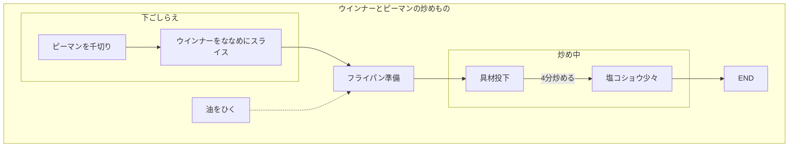

```mermaid
graph TB;
    cut_u[ウインナーをななめにスライス]
    cut_p[ピーマンを千切り]
    set_f[フライパン準備]
    fire_a[具材投下]
    fire_b[塩コショウ少々]

    subgraph ウインナーとピーマンの炒めもの
        subgraph 下ごしらえ
            cut_p-->cut_u
        end

        cut_u-->set_f
        set_f-->fire_a
        
        subgraph 炒め中
            fire_a--4分炒める-->fire_b
        end
        fire_b --> END

        油をひく-.->set_f

    end

```